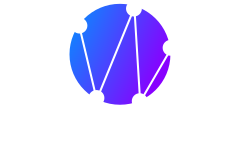

<div align="center">
  
  
  <h3>Your One-Stop Campus Solution</h3>
  
  <p>A comprehensive web platform for students and clubs at SRM, featuring attendance tracking, timetable management, event discovery, and more.</p>

[](https://github.com/CampusDataSRM/campusweb/actions/workflows/build.yml)
[](LICENSE)
[](CONTRIBUTING.md)
[](https://github.com/CampusDataSRM/campusweb/issues)

</div>

---

## ✨ Features

### Student Portal

- 📊 **Dashboard** — Personalized overview with stats and quick navigation
- 📅 **Attendance Tracking** — View and monitor attendance records with predictions
- 🕐 **Timetable** — Class schedule viewer with PDF export
- 📈 **CGPA Calculator** — Calculate and track academic performance
- 📝 **Marks Overview** — View test performance and grades
- 🗓️ **Planner** — Daily/monthly task and event planner
- 🎉 **Events** — Browse and RSVP to campus events
- 🏛️ **Clubs** — Discover, follow, and join campus clubs
- 🍽️ **What's in Mess** — Real-time mess menu checker
- 📆 **Calendar** — Academic and event calendar

### Club Portal

- 👤 **Profile Management** — Update club information and branding
- 📊 **Admin Dashboard** — Analytics and club management
- 📋 **Event Management** — Create, edit, and manage club events

## 🛠️ Tech Stack

| Layer          | Technology                                                                                                    |
| -------------- | ------------------------------------------------------------------------------------------------------------- |
| **Framework**  | [Next.js 14](https://nextjs.org/) (App Router)                                                                |
| **UI**         | [React 18](https://react.dev/), [Tailwind CSS](https://tailwindcss.com/) |
| **Charts**     | [Chart.js](https://www.chartjs.org/) + [react-chartjs-2](https://react-chartjs-2.js.org/)                     |
| **Analytics**  | PostHog, Google Analytics, Microsoft Clarity                                                                  |
| **Deployment** | Firebase Hosting, Fly.io (Docker)                                                                             |

## 🚀 Getting Started

### Prerequisites

- [Node.js](https://nodejs.org/) ≥ 20.x
- [npm](https://www.npmjs.com/) (comes with Node.js)
- [Git](https://git-scm.com/)

### Installation

1. **Clone the repository**

   ```bash
   git clone https://github.com/CampusDataSRM/campusweb.git
   cd campusweb
   ```

2. **Install dependencies**

   ```bash
   npm install
   ```

3. **Set up environment variables**

   ```bash
   cp .env.example .env.local
   ```

   Fill in the required values in `.env.local`. See [`.env.example`](.env.example) for all available variables.

4. **Start the development server**
   ```bash
   npm run dev
   ```
   Open [http://localhost:2560](http://localhost:2560) in your browser.

### Available Scripts

| Command         | Description                           |
| --------------- | ------------------------------------- |
| `npm run dev`   | Start development server on port 2560 |
| `npm run build` | Build for production (static export)  |
| `npm run start` | Start production server               |
| `npm run lint`  | Run ESLint                            |

## 📁 Project Structure

```
campusweb/
├── app/                    # Next.js App Router pages
│   ├── client/             # Authentication pages (login, signup)
│   ├── club/               # Club portal (profile, admin dashboard)
│   ├── student/            # Student portal (attendance, timetable, etc.)
│   ├── layout.js           # Root layout with providers & analytics
│   ├── globals.css         # Global styles & Shadcn theme tokens
│   └── page.js             # Landing page
├── components/             # Reusable React components
│   ├── global/             # Shared (navbar, loader, event/club cards)
│   ├── student/            # Student-specific (stats, timetable widgets)
│   ├── club/               # Club-specific (profile/password update)
│   └── ui/                 # Shadcn UI primitives
├── constants/              # App constants (API base URLs)
├── functions/              # Utility functions
│   ├── api/                # API call helpers (student, club)
│   └── providers/          # Context providers (PostHog analytics)
├── hooks/                  # Custom React hooks
├── lib/                    # Shared utilities
└── public/                 # Static assets (images, icons, manifest)
```

## 🔌 API

CampusWeb connects to an external backend API. The base URL is configured via the `NEXT_PUBLIC_SERVE` environment variable. See the [documentation](docs/campusweb_documentation.md) for the full API reference.

## 🤝 Contributing

We welcome contributions! Please read our [Contributing Guide](CONTRIBUTING.md) before submitting a Pull Request.

1. Fork the repository
2. Create your branch (`git checkout -b username/feat/amazing-feature`)
3. Commit your changes (`git commit -m 'feat: add amazing feature'`)
4. Push to the branch (`git push origin username/feat/amazing-feature`)
5. Open a Pull Request

Please also read our [Code of Conduct](CODE_OF_CONDUCT.md).

## 🔒 Security

To report security vulnerabilities, please see our [Security Policy](SECURITY.md).

## 📄 License

This project is licensed under the MIT License — see the [LICENSE](LICENSE) file for details.

## 🙏 Acknowledgments

Built with ❤️ by [Campus Web](https://github.com/CampusDataSRM)
